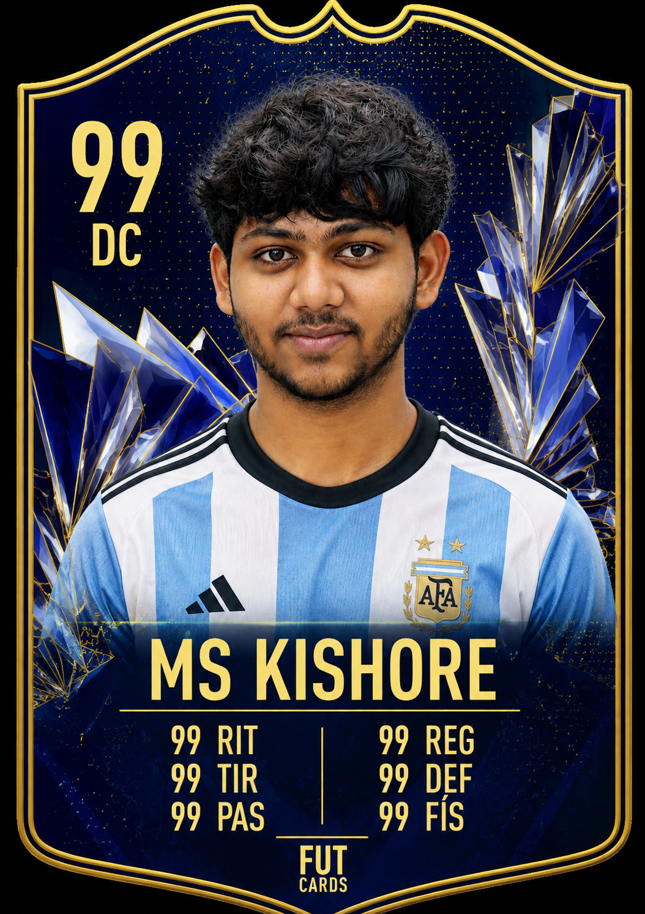

# ⚡ MS KISHORE

### `DEVELOPER` • `VIBECODER` • `BUILDER`

 

`🟢 ONLINE` &nbsp;&nbsp; `OVR 94` &nbsp;&nbsp; `KISHORE_DEV`

  

---

## 🎮 PLAYER PROFILE

| ⚡ PAC | 🎯 DRI | 🧠 PAS | 💥 SHO | 🛡️ DEF | 💪 PHY |
|:---:|:---:|:---:|:---:|:---:|:---:|
| **92** | **95** | **88** | **90** | **40** | **80** |

`POSITION: DEVELOPER` &nbsp; `PLAYSTYLE: VIBECODER` &nbsp; `FOOT: KEYBOARD`

---

## 🧬 ABOUT ME

I build things, break things, fix things, and somehow ship them.

I **vibe-code** my way from random ideas to working software.

I like building products that actually do something instead of sitting
in a folder named `final_final_v2`.

> **IF IT COMPILES, IT'S A FEATURE.**

---

## 🧰 TECH STACK

---

# 📡 LIVE GITHUB // PLAYER DATA

  

---

# 🚧 CURRENTLY BUILDING

### 🟢 NOVA

`AI` • `AUTOMATION` • `BUILDING IN PUBLIC`

 

### 🟢 MAX — GENZ NEWS

`NEWS` • `GEN Z` • `REAL-TIME`

---

# 🎮 PLAYSTYLE

### ⚡ VIBECODER

Ideas → Code → Error → Fix → Ship

### 🛠️ BUILDER

If there's an idea, I'll probably try to build it.

### 🧠 PROBLEM SOLVER

`BUG FOUND` → `LOCK IN`

### 🌙 NIGHT CODER

Sleep is temporarily unavailable.

---

# 🏆 ACHIEVEMENTS

| 🚀 BUILDER | ⚡ VIBECODER | 🧠 DEBUGGER | 🔥 SHIPPER |
|:---:|:---:|:---:|:---:|
| `UNLOCKED` | `ACTIVE` | `GRINDING` | `ACTIVE` |

 

`IDEA` → `BUILD` → `BREAK` → `FIX` → `SHIP`

---

# 📋 MANAGER NOTES

> Creative player with an aggressive attacking style.
>
> Takes questionable technical decisions.
>
> Somehow gets the job done.
>
> **Potential: HIGH**
>
> **Sleep schedule: UNKNOWN**

---

# ⚽ NEXT MATCH

### `BUILD SOMETHING EPIC`

`STATUS: 🟢 READY`

 

**BUILD • BREAK • FIX • SHIP • REPEAT**

 

`eFOOTBALL MODE: ON`  
`VIBE CODING: ENABLED`  
`SLEEP: DISABLED`

  

### MS KISHORE

`PLAYER ID: KISHORE_DEV`

